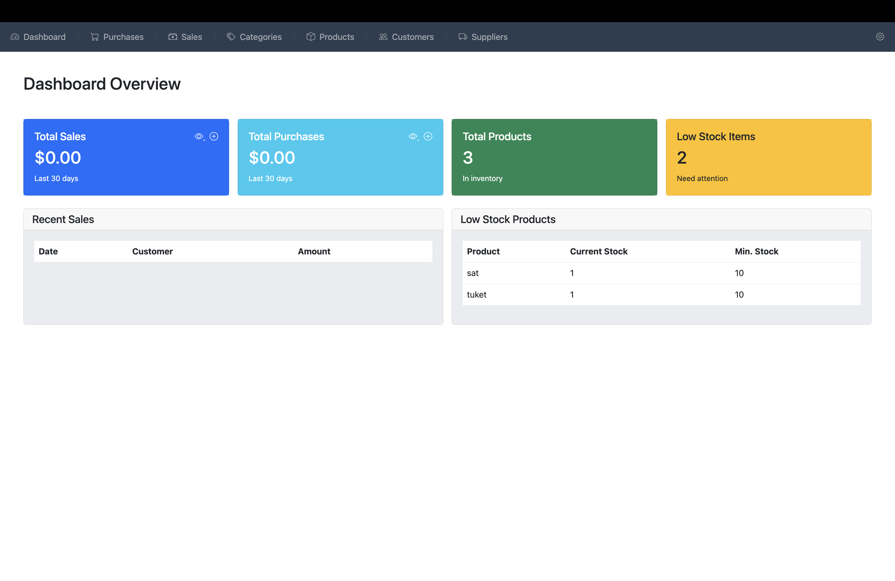
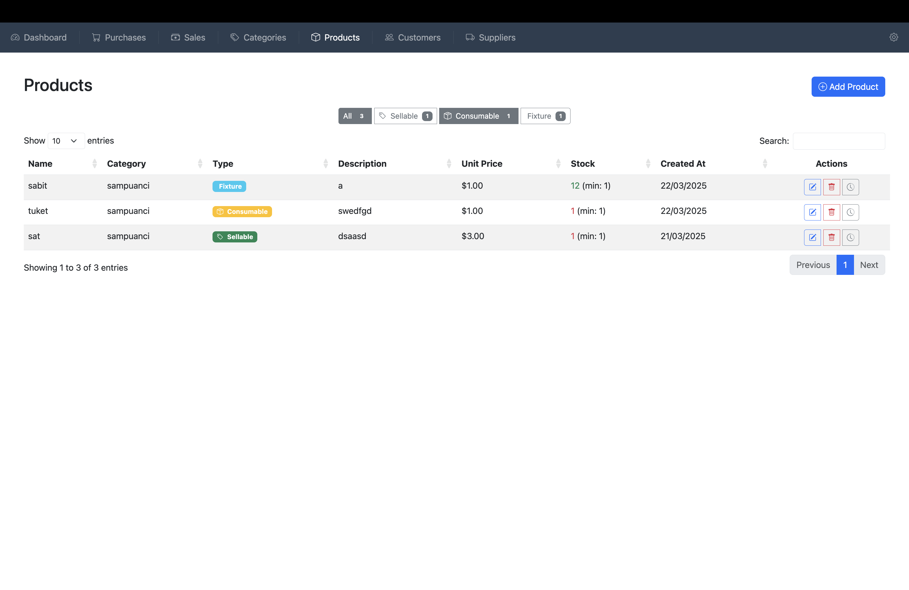
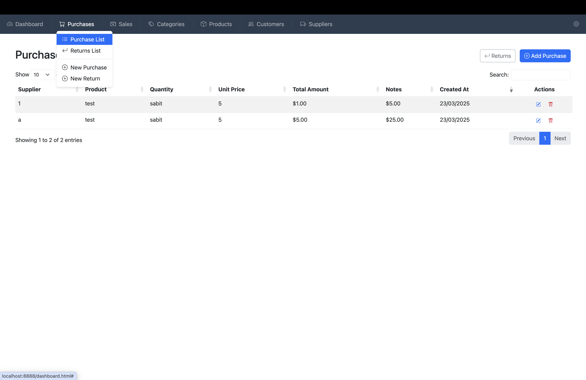
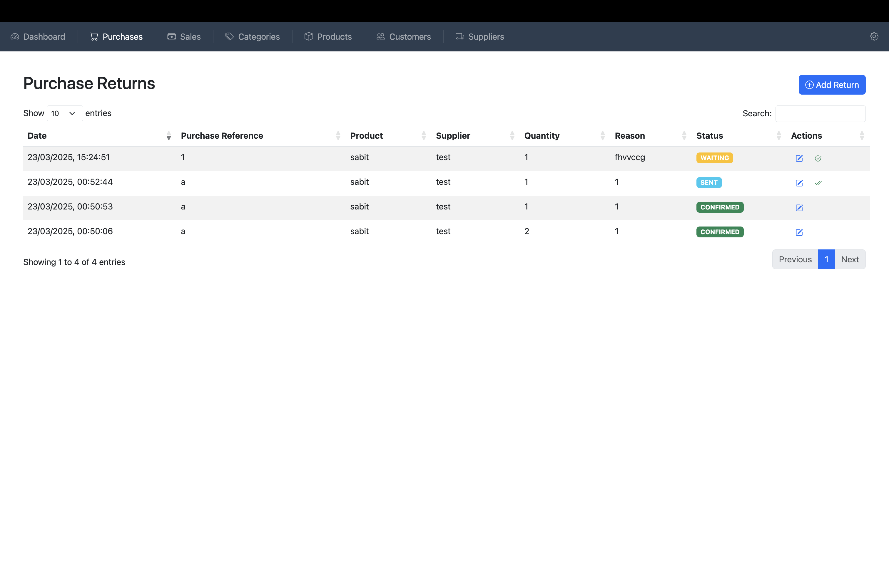
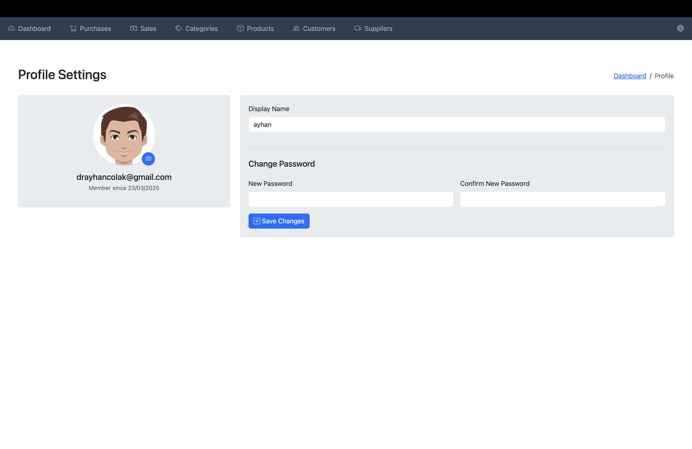

# Inventory Management System with Supabase

A modern web-based inventory management system built with Supabase as the backend. This project demonstrates how to create a full-featured inventory system using Supabase's powerful features including authentication, real-time database, and storage capabilities.

## Screenshots








## Database Setup

### 1. SQL Tables
Execute the following SQL in your Supabase SQL editor (`db/schema.sql`):
```sql
-- Create tables for inventory management system
-- Copy the entire content from db/schema.sql
```

### 2. Storage Setup
1. Create a new bucket named `inventory-avatar` with the following settings:
   - Public bucket: No
   - File size limit: 5MB
   - Allowed mime types: image/*

### 3. Storage Policies
For the `inventory-avatar` bucket, add these policies:

```sql
CREATE POLICY "Allow authenticated users to select from inventory-avatar bucket" 
ON storage.objects 
FOR SELECT 
TO authenticated 
USING (bucket_id = 'inventory-avatar');

CREATE POLICY "Allow authenticated users to insert into inventory-avatar bucket" 
ON storage.objects 
FOR INSERT 
TO authenticated 
WITH CHECK (bucket_id = 'inventory-avatar');

CREATE POLICY "Allow authenticated users to update inventory-avatar bucket" 
ON storage.objects 
FOR UPDATE 
TO authenticated 
USING (bucket_id = 'inventory-avatar') 
WITH CHECK (bucket_id = 'inventory-avatar');

CREATE POLICY "Allow authenticated users to delete from inventory-avatar bucket" 
ON storage.objects 
FOR DELETE 
TO authenticated 
USING (bucket_id = 'inventory-avatar');
```

### 4. Database Policies

```sql
CREATE POLICY "Allow authenticated users to select" ON public.categories
FOR SELECT
TO authenticated
USING (true);

CREATE POLICY "Allow authenticated users to insert" ON public.categories
FOR INSERT
TO authenticated
WITH CHECK (true);

CREATE POLICY "Allow authenticated users to update" ON public.categories
FOR UPDATE
TO authenticated
USING (true)
WITH CHECK (true);

CREATE POLICY "Allow authenticated users to delete" ON public.categories
FOR DELETE
TO authenticated
USING (true);

CREATE POLICY "Allow authenticated users to select" ON public.customers
FOR SELECT
TO authenticated
USING (true);

CREATE POLICY "Allow authenticated users to insert" ON public.customers
FOR INSERT
TO authenticated
WITH CHECK (true);

CREATE POLICY "Allow authenticated users to update" ON public.customers
FOR UPDATE
TO authenticated
USING (true)
WITH CHECK (true);

CREATE POLICY "Allow authenticated users to delete" ON public.customers
FOR DELETE
TO authenticated
USING (true);

CREATE POLICY "Allow authenticated users to select" ON public.products
FOR SELECT
TO authenticated
USING (true);

CREATE POLICY "Allow authenticated users to insert" ON public.products
FOR INSERT
TO authenticated
WITH CHECK (true);

CREATE POLICY "Allow authenticated users to update" ON public.products
FOR UPDATE
TO authenticated
USING (true)
WITH CHECK (true);

CREATE POLICY "Allow authenticated users to delete" ON public.products
FOR DELETE
TO authenticated
USING (true);

CREATE POLICY "Allow authenticated users to select" ON public.purchase_returns
FOR SELECT
TO authenticated
USING (true);

CREATE POLICY "Allow authenticated users to insert" ON public.purchase_returns
FOR INSERT
TO authenticated
WITH CHECK (true);

CREATE POLICY "Allow authenticated users to update" ON public.purchase_returns
FOR UPDATE
TO authenticated
USING (true)
WITH CHECK (true);

CREATE POLICY "Allow authenticated users to delete" ON public.purchase_returns
FOR DELETE
TO authenticated
USING (true);

CREATE POLICY "Allow authenticated users to select" ON public.purchases
FOR SELECT
TO authenticated
USING (true);

CREATE POLICY "Allow authenticated users to insert" ON public.purchases
FOR INSERT
TO authenticated
WITH CHECK (true);

CREATE POLICY "Allow authenticated users to update" ON public.purchases
FOR UPDATE
TO authenticated
USING (true)
WITH CHECK (true);

CREATE POLICY "Allow authenticated users to delete" ON public.purchases
FOR DELETE
TO authenticated
USING (true);

CREATE POLICY "Allow authenticated users to select" ON public.sales
FOR SELECT
TO authenticated
USING (true);

CREATE POLICY "Allow authenticated users to insert" ON public.sales
FOR INSERT
TO authenticated
WITH CHECK (true);

CREATE POLICY "Allow authenticated users to update" ON public.sales
FOR UPDATE
TO authenticated
USING (true)
WITH CHECK (true);

CREATE POLICY "Allow authenticated users to delete" ON public.sales
FOR DELETE
TO authenticated
USING (true);

CREATE POLICY "Allow authenticated users to select" ON public.stock_movements
FOR SELECT
TO authenticated
USING (true);

CREATE POLICY "Allow authenticated users to insert" ON public.stock_movements
FOR INSERT
TO authenticated
WITH CHECK (true);

CREATE POLICY "Allow authenticated users to update" ON public.stock_movements
FOR UPDATE
TO authenticated
USING (true)
WITH CHECK (true);

CREATE POLICY "Allow authenticated users to delete" ON public.stock_movements
FOR DELETE
TO authenticated
USING (true);

CREATE POLICY "Allow authenticated users to select" ON public.suppliers
FOR SELECT
TO authenticated
USING (true);

CREATE POLICY "Allow authenticated users to insert" ON public.suppliers
FOR INSERT
TO authenticated
WITH CHECK (true);

CREATE POLICY "Allow authenticated users to update" ON public.suppliers
FOR UPDATE
TO authenticated
USING (true)
WITH CHECK (true);

CREATE POLICY "Allow authenticated users to delete" ON public.suppliers
FOR DELETE
TO authenticated
USING (true);
```

## About

This system provides a complete solution for managing inventory, featuring:
- Secure user authentication through Supabase Auth
- Real-time data synchronization using Supabase's Postgres database
- File storage for user avatars using Supabase Storage
- Modern, responsive UI built with Bootstrap 5

## Setup

1. Clone the repository:
```bash
git clone https://github.com/drascom/inventory-system-supabase.git
```

2. Copy `assets/js/config.example.js` to `assets/js/config.js` and update with your Supabase credentials:
```bash
cp assets/js/config.example.js assets/js/config.js
```

3. Open `index.html` in your web browser or use a local server (like Live Server in VS Code)

## Features

- **User Authentication**
  - Email/Password login
  - Magic link authentication
  - User profile management
  - Avatar upload and management

- **Inventory Management**
  - Product Management
  - Stock tracking
  - Category organization
  - Multiple product types (Sellable, Consumable, Fixture)

- **Business Operations**
  - Sales Management
  - Purchase Management
  - Supplier Management
  - Customer Management
  - Stock Movement Tracking

## Technologies Used

- **Frontend**
  - HTML5
  - CSS3 with Bootstrap 5
  - Vanilla JavaScript
  - DataTables for data display
  - Select2 for enhanced dropdowns

- **Backend (Supabase)**
  - Supabase Auth for authentication
  - Supabase Database (Postgres) for data storage
  - Supabase Storage for file uploads
  - Real-time subscriptions

## Database Schema

The system uses a comprehensive database schema including tables for:
- Products
- Categories
- Suppliers
- Customers
- Stock Movements
- User Profiles

## Contributing

Feel free to fork this repository and submit pull requests. You can also open issues for any bugs or feature requests.

## License

MIT License - feel free to use this project for learning or business purposes.
